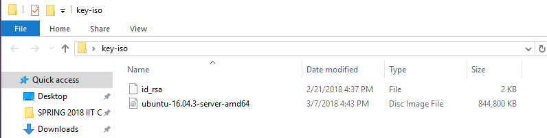

# How to build PACKER & VAGRANT INFRASTRUCTURE

This guide will demonstrate how to get the Vagrant environment up and running on Windows and MAC

## Step 1 ##

CLONE GITHUB REPO to make we have the latest release of our build
 
## Step 2 ##

Open up a windows PowerShell terminal

## Step 3 ##

Install vagrant VirtualBox plugin

Command : vagrant plugin install vagrant-vbguest

## Step 4 ##

Open our team GitHub file directory on your local machine (Make sure you clone the repo beforehand)

## Step 5 ##

Click on "PackerVagrant" then "vagrant-current-builds". Now you should see the directory with our current server builds.

## Step 6 ## 

Drag and drop the WebserverS3 folder onto your desktop

## Step 7 ##

Now locate your folder where you have YOUR "id_rsa" key and also ubuntu ISO

## Step 8 ## 

Copy and paste your id_rsa key and ubuntu iso into the WebserverS3 folder

## Step 9 ##

Open up windows PowerShell and navigate to the WebserverS3 directory

Now list the directory with the "ls" command

command: ls

## Step 10 ##

We will now be using PACKER

on the windows PowerShell enter the command: packer build ubuntu16043-vanilla.json

You should now see that packer will open up your virtual machine and start the configuration 
(PACKER GHOST)

Leave everything alone and be patient, packer will close the virtual box by its self and finish exporting the box file.

## Step 11 ##

Packer will create a folder named "build" and within that file will be are ubuntu box file 

Now go back to your windows power shell and make sure you are still in the WebserverS3 directory. 
Then copy the text exactly how I do it, highlight it and then press Ctrl + c

Then on the command line type: vagrant box add  --name node1

you will now copy and paste your box file address in between add & --name

The final command should have the same structure as the one below 
(WARNING, you cannot copy my command below because the box file will have a different number than yours)

vagrant box add ../build/ubuntu-vanilla-16043-server-virtualbox-1520556776.box --name node1

## Step 12 ## 

now on the windows PowerShell command line type: vagrant up

## Step 13 ## 

Our vagrant box is now up, we now need to ssh into our VirtualBox

command: vagrant ssh

## Power Down Vagrant Box ##

When you are ready to power down the server you will have two options

vagrant halt: Will shutdown the system without destroying it, this will take resources from your hard drive but not much.

vagrant destroy: Will destroy the machine and remove resources from your system. When you run vagrant up you will have a newly built machine to start working on again. (I use this option)

## Clean WebserverS3 folder ##

Delete the following file from the WebserverS3 directory

packer_cache

Delete the build folder
(you can keep this folder if you want to add another of the same vagrant box)

## MUST DO WHEN REBUILDING TO AVOID ERRORS ##

When new configs are made to our server and we need to do this rebuilding process again there are a few things we need to think about. If we need to build a new config of our server and it still has the same vagrant box name we must remove it from the vagrant box list, because otherwise when we do vagrant box add command it will give you an error ( you can use the --force flag to overcome this). If we are using a new name for the server then we are fine and dont have to follow this guideline.

### Guide Written by Matteo Giaimo ###

