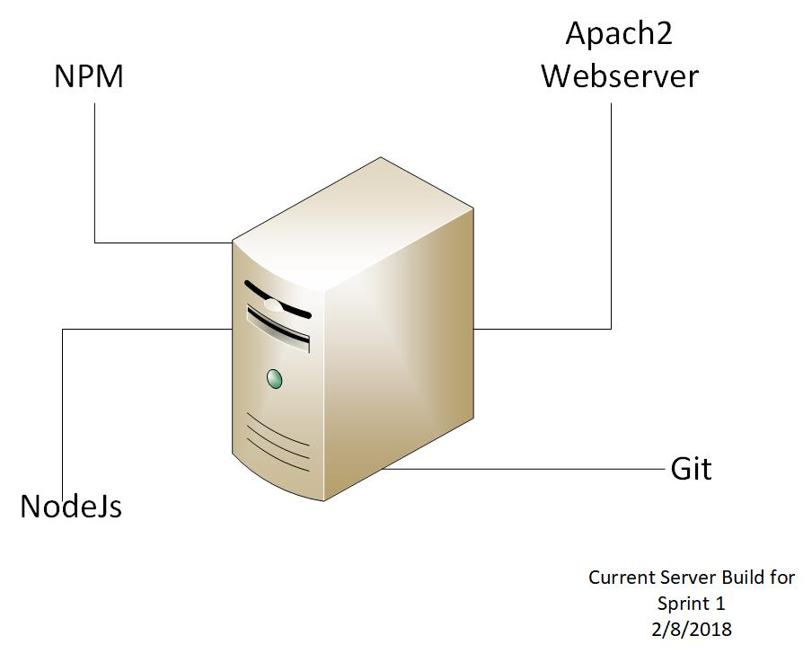
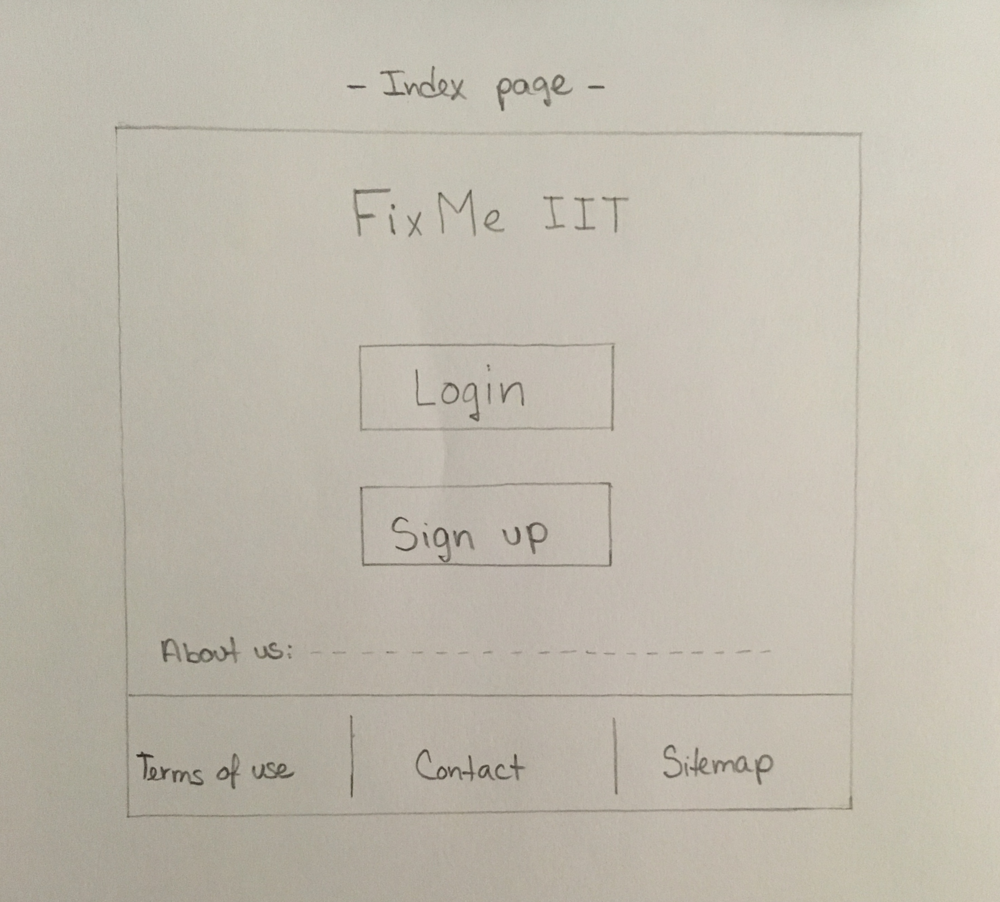
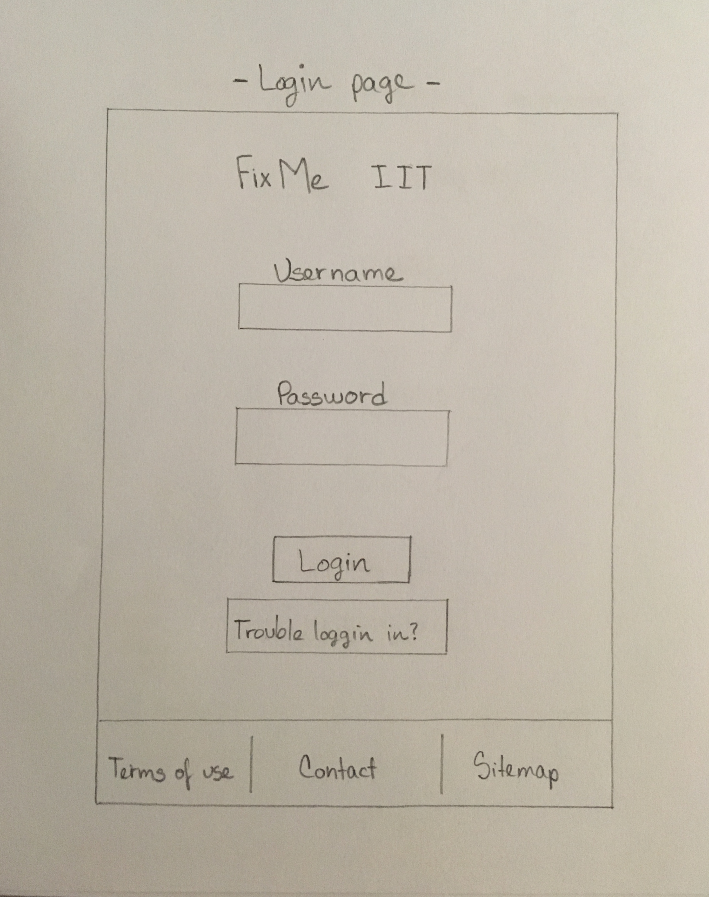
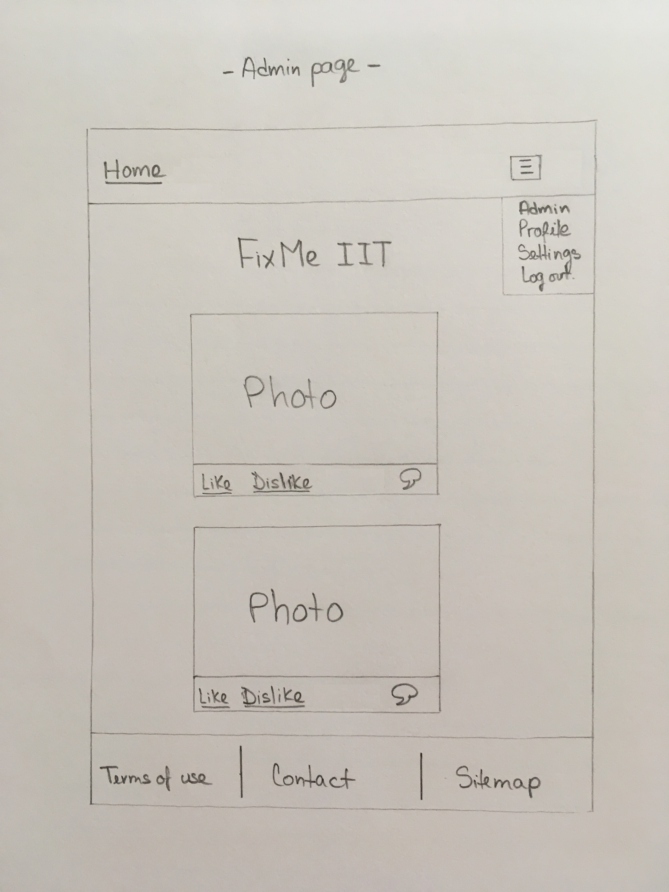
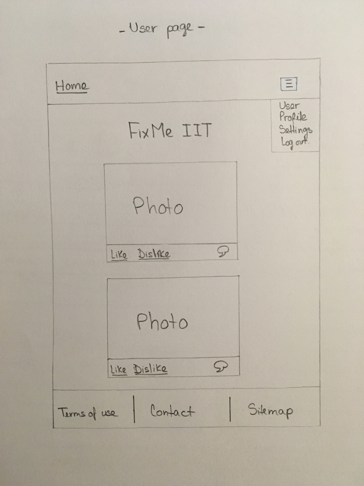
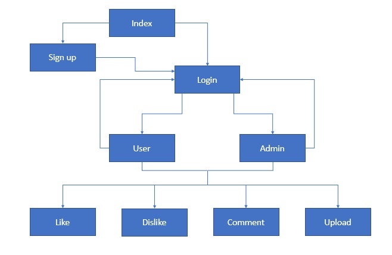
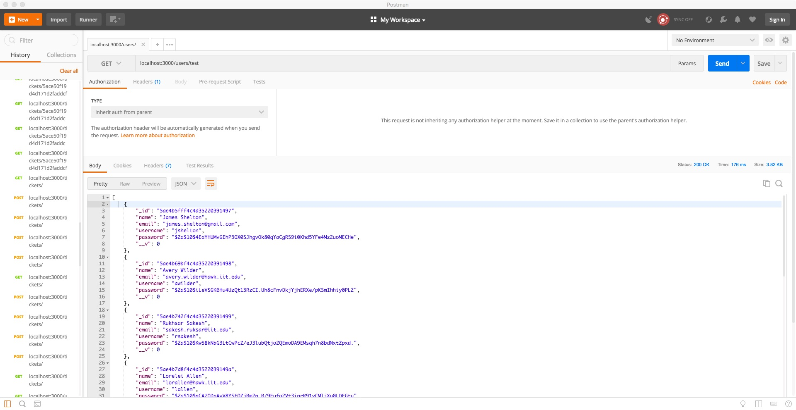
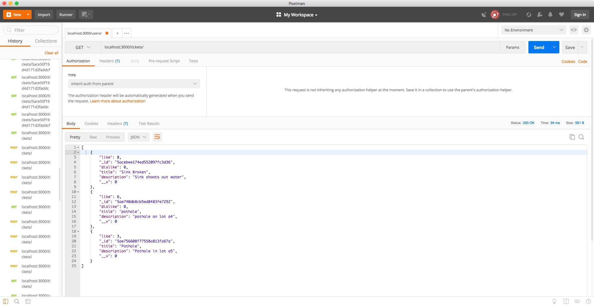

# Final Report Team 6

FixIIT is an application that would allow people on campus to open tickets for things that need fixing around campus. The application was built by a group of 5 students, each with a different background, experience levels, and different career goals. Throughout the semester we rotated jobs in order to get a feel of what it is like to work in an agile development environment. The roles included Project Manager, Developer, JR Developer, UI/UX developer, and IT ops.

## Team Members

### Leydi Suriano
"I didn't have any experience developing applications. This is my first encounter to that part of the process. I am more familiar with the web design (html and css) part as I was able to learn that on previous classes. I have also learned C++, Java, SQL throughout my studies at IIT. I have never worked with Javascript previously. I don't have any real world experience with any IT stuff, only what I have learned on my own during these last couple of years. This project was the first time I actually got to see the whole process of creating and developing an application."

### Thomas Boller
"Within the IT world my background is limited to what I have done in school.  I have
worked the most in programming and scripting. I have worked with several scripting languages
such as Bash, Powershell, and Perl. In the programming world I had worked with C, C++, Java,
Python, Android, XML and some limited amount I had worked with ORM.  This was my first major
foray into Javascript and web application developlment, both front and back end. It was also the
first I had worked with tools such as Packer, Vagrant, and Git."

### Matteo Giaimo
"I have an associates degree from the College of Dupage in Computer internetworking and technology. I am also CCNA certified by Cisco, and as well have a certificate in CCNA security. The background i come from is more on the hardware and infrastructure side. I am skilled in creating networks, building servers, system administration, testing the builds, and documenting. My weakness is on the development side, i am not that creating with creating applications but i know how to get the applications run on the servers."

### Vince Giaimo
"I have completed an associates degree in Computer Information Technology from College of Dupage. I have completed the CCNA program and have recieved my CCNA certification. My Intrest in IT is everything, the more you know the better. I would like to learn as much as I can to make my IT skills the best they could be"

### Emmanuel Zambrano
"I have a specialization in Web Development. I have taken coursework in information architecture, human computer interaction, and user experience. I am interested in how information is displayed and the design process."

## Accomplishments for all sprints

### Sprint 1: Accomplishments

1. Develop the architecture for our application and the UI/UX drawings.  
2. Create Database's main tables.
3. Create a working packer/vagrant box for our server.

### Sprint 2: Accomplishments

1. Automate github repo to vagrant box using deploy keys
4. Initial splash page upon and hello world application
5. Getting NPM to run on Vagrant

### Sprint 3: Accomplishments

1. Implement JWT authentication on backend.
2. Incorporate Mongoose ODM
3. Get our backend and front end both running on vagrant

### Sprint 4: Accomplishments

1. Connected Angular Front End Register page to the Database through the back end.
2. Divided our css into separate files, to make it easy for the angular frontend to implement.
3. Completed html and css design for angular frontend (home, login, register, user and admin components).
4. Added functionality to create, view, update, and delete tickets through the backend API.
5. Created the ReadMe file that demonstrates how to build our current infrastructure.
6. Created a new json packer file to be able to build a server without having to use an Ubuntu ISO file.

### Sprint 5: Accomplishments
1. Getting front end done for creating tickets
2. Finish voting functionality
3. Complete Login function using Angular Frontend
4. Finalize our webpages design

## Assessment

In the beginning of the semester we challenged ourselves with finishing completing the following work in each sprint:

Sprint 1:
Develop application architecture and UI/UX mappings
Create Shell of application and Webpages (HELLO WORLD)
Have apache web server up

Sprint 2:
User Login available
Non user/login web page
Initial splash page upon login

Sprint 3:
Application Function: Upload/store tickets and Images
Application Function: View/Edit tickets and Images

Sprint 4:
Application Function: Voting process
Application Function: Final decision news feed

Sprint 5:
Conversion of code/Android application development
Web application user testing

Our team accomplished many of our goals. However, there were constraints throughout the semester that caused us to miss some of our initial goals. Some goals were changed throughout the semester because of things that we were learning as we were creating the application.

### Features to implement

Here are a few features that we would need to implement in the future in order to create a more robust application.
1. Have more features for admin users.
2. Fine tune our design.
3. Create tests for our application.
4. Integrate Amazon s3 for storing images.

## 1. Language and framework

The application was built using NodeJS, ExpressJS, Angular, Linux, MongoDB. These four technologies create what is known as the MEAN stack. It is a very popular stack because it allows us to create everything from the frontend to the backend to the database with Javascript. NodeJS provides backend, or server side, coding capability. Angular provides a highly organized and extremely scalable means of front end, or client side, development. ExpressJS allows for connection between the previous two, as well as the organizational method for MVC architecture. Finally MongoDB is a document based database system. While we all were more familiar with Java application programming the MEAN stack offered us much more in capability, and also a bit of healthy challenge.

## 2. Operating System Platform

Our operating platform we are using is Ubuntu 16.04.3 long term support, we are using this because it consumes less resources and we can create identical machine images utilizing ubuntu along with packer in doing so we are able to use version control with our operating system. There are many applications that we can download for ubuntu server, also there is a lot of available resources on the internet that we can use for reference.

## 3. Use of Data Store/Storage

Data is stored on a Mongo Database hosted on MLab.  We are storing our data using MLab for three reasons.
 1. Storing data on a scaleable cloud service would be ideal for a starting company.
 2. It seemed important to learn to use cloud services in our application.
 3. MLab has free hosting.

Our images are going to be stored on AWS.  This will allow us to not go over the MLab free limit, and give us further introduction to cloud services.

## 4. Data encrypted at rest

Our data is hosted on MLab which is encrypted.

## 5. Database makes use of master/slave replication

Working with MLab, it was unclear how to implement this.

## 6. Use of Responsive design

Our team has implemented media queries with in our web design to make our webpage more user friendly by allowing the webpage conform to various screen sizes.

## 7. Use of https

There were many security measures that we took with our application. Some being having our passwords before storing them in the database, and not having keys on our repository. We could not get around to creating self signed certs.

## 8. Use of user authentication

We are authenticating users using JWT and PassportJS. We chose this method to allow users to authenticate with our RestAPI.

## 9. Creation of Dev Environment

Our Dev environment includes the using the tooling of packer and vagrant and GitHub, which we are automating the build of our operating system using packer. The two virtual machines images that we have created using packer includes webserver, nginx load balancer. We automate the deployment using vagrant and the provider we are using with vagrant is virtual box.

## 10. Layout design

### Header:
•Admin and User page will have a header that includes a HOME button in the left side, along with an upload button, a dropdown MENU and a logout icon in the right side.
•Background color:  Light grey.
•Font-family: “Arial”.
•Font color: Black.
•Font size: 16px.
•Alignment: Center.

### Footer:
•Every Page will have a footer that includes TERMS OF USE, CONTACT and SITEMAP buttons.
•Background color:  Light grey.
•Font-family: 'Sofia', "Arial Black", "Arial Bold", Gadget, sans-serif.
•Font color: Black.
•Alignment: Center.

### Logo:
•Every page will have the application logo right underneath the header (except the contact, terms of use and sitemap pages).
•The logo will be FixMe IIT.

### Body Content (index and login pages):
•The index and login pages will consist of buttons and input text fields.
•Font-family: 'Sofia', "Arial Black", "Arial Bold", Gadget, sans-serif.
•Font color: Black.
•Alignment: Center.

### Body Content (user and admin pages):
•The user and admin pages will consist of a newsfeed with a like and dislike button, along with a comment bubble icon.
•Font-family: 'Sofia', "Arial Black", "Arial Bold", Gadget, sans-serif.
•Font color: Black.
•Alignment: Center.

## 11. Management of diagram tool of workflow

## 12. Management of project progress

We are using Trello to manage tasks that are assigned to individual team members and to keep track on what tasks are completed and tasks that need more time to be resolved.

Our Team has made use of slack to communicate with each other and to make sure everyone is on the same on track with the project sprint. Also, we use slack to help each other resolve issue or set up meetings to discuss project details.

Github is used as our version control to store our documentation, artifacts, code, configuration files, etc.

## 13. Team must generate at least 15 real “test” user data that is inserted upon instance creation and proper data to test functionality of a system

Test users were created by using Postman to make requests to the API.

