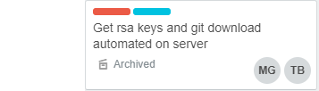

# Midterm Report - Team 6

## 1.Team member Introduction 
Vince Giaimo

Matteo Giaimo

Thomas Boller

Emmanuel Zambrano

Leydi Suriano

## 2.Introduce project concept, the project name and what the expected project scope

The concept of our project is to create a web application that allows users to post and share pictures and vote on items they would like to fix on the IIT Campus. The name of our project is FixIIT and what we expect to deliver as our finished project is an application that is like a social media application, which allows users to create accounts, login, upload, vote, and manage content. 

## 3.Introduce Industry Competitors

The industry competitors our web-application competes with is Facebook and Instagram. These are social media sites that allow users to post images/content, where people can give feedback based on the content that is posted. 

## 4. Introduce Sprint Goals

Primary goals for Third sprint

1. Apache2 server running https protocol for security
2. Implement social media authentication
3. Incorporate Mongoose ODM 
4. Get our backend and front end both running on vagrant 
5. add features to webpages/design

The goals were chosen to improve our webpage to make it more secure and user friendly. First, we wanted to create secure webpage connection for our users, so traffic will be encrypted. 

## 5.Explain your progress on the 13 base project requirements

1. **Language and framework**

We chose to use NodeJS, ExpressJS, Angular, Linux, MongoDB. These four items were chosen because together they combine as the MEAN stack. NodeJS provides backend, or server side, codeing capability. Angular provides a highly organized and extremely scalable means of front end, or client side, development. ExpressJS allows for connection between the previous two, as well as the organizational method for MVC architecture. Finally MongoDB is a document based database system. While we all were more familiar with Java application programming the MEAN stack offered us much more in capability, and also a bit of healthy challenge. 

2. **Operating System Platform**

Our operating platform we are using is Ubuntu 16.04.3 long term support, we are using this because it consumes less resources and we can create identical machine images utilizing ubuntu along with packer in doing so we are able to use version control with our operating system. There are many applications that we can download for ubuntu server, also there is a lot of available resources on the internet that we can use for reference.

3. **Use of Data Store**

Data is stored on a Mongo Database hosted on MLab.  We are storing our data using MLab for three reasons. 
 1. Storing data on a scaleable cloud service would be ideal for a starting company.
 2. It seemed important to learn to use cloud services in our application.
 3. MLab has free hosting.
 
Our images are going to be stored on AWS.  This will allow us to not go over the MLab free limit, and give us further introduction to cloud services.

4. **Data encrypted at rest**

We have been working on implementing https protocol on our webpage. Also, we have implemented google authentication for our users.

5. **Database makes use of master/slave replication**

Database is hosted on MLab, which offers redundancy.

6. **Use of Responsive web design**

Our team has implemented media queries with in our web design to make our webpage more user friendly by allowing the webpage conform to various screen sizes.

7. **Use of https**

The team has been working on implementing the https protocol within our webpage, currently we do not have it at a fully functional state. We are trying to configure our load balancer and webservers to use https protocol, but we have been running into issue with configuring this, so more time is needed to research. In regard to self-signed certs we are going to use openSSL to create our self-sign certificate.

8. **Use of user authentication**

We are authenticating users using JWT and PassportJS. We chose this method to allow users to authenticate with our RestAPI.

9. **Creation of Dev Environment**

Our Dev environment includes the using the tooling of packer and vagrant and GitHub, which we are automating the build of our operating system using packer. The two virtual machines images that we have created using packer includes webserver, nginx load balancer. We automate the deployment using vagrant and the provider we are using with vagrant is virtual box.

10. **Layout and Design**

 Our team has created a simple mobile and user friendly site that allows users to log into their account and post pictures that others can vote or comment on. Also, we will implement an administrator page that lets users edit or remove posts. 

11. **Management of Visio**

We have used Visio design to map out what services we are going to implement within our server.

12. **Management of Project Progress**

We are using Trello to manage tasks that are assigned to individual team members and to keep track on what tasks are completed and tasks that need more time to be resolved.

Our Team has made use of slack to communicate with each other and to make sure everyone is on the same on track with the project sprint. Also, we use slack to help each other resolve issue or set up meetings to discuss project details.

Github is used as our version control to store our documentation, artifacts, code, configuration files etc.

13. **Team must generate at least 15 real “test” users and proper data to test functionality of a system**
Test users were created by using Postman to make requests to the API. 

## 6.Trello and Github boards to goal mapping

1. In this task our goal was to retrieve our RSA Keys from github and have them automated onto the server. This will allow team members to access files needed for development. 

**Trello Task**

**Private Key**

**GitHub Keys**

**Pakcer json file running shell script to automate Github Repo Cloning**

**Shell Script to clone Repo** 

**Make Vagrant user the owner of the cloned git repository**

2. We have created a packer file to automate building our nginx load balancer. This load balancer is being used to ensure both webservers are being equally used, also if one server fails our website will still function. 

**Trello Task**

**Automated install of Nginx load balancer**

**To forward Nginx traffic to the correct IP address**

**Displaying status of Nginx server**

3. In this Trello task we are automating the building dependencies of nodejs and making sure it runs. 

**Trello Task**

**Automated installation of nodejs depenedencies**

**Starting nodejs application**

**Displaying our nodejs application** 

**Displays user tests**

## 7.What has been learned and new plans/techniques will be implemented in the remaining sprints

The team has learned to carefully push and pull from GitHub and always have backup files saved before making any major changes. We have also learned that communication and team work must be in sync otherwise issue will occur. First, new plan will be to futher implement the translation of html code into angular. New technique that we will be using is to have group members test build on their end, inorder to find and reduce errors.     

## References

- https://blog.codeship.com/packer-vagrant-tutorial/
- Instructor Packer.io tutorial
- The Dev Ops Handbook-Ch.9
- https://nodejs.org/en/download/package-manager/
- https://www.w3schools.com/howto/howto_css_team.asp
