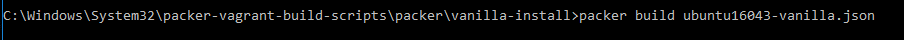

# How to Configure Vagrant Environment

This guide will demonstrate how to get the Vagrant environment up and running on windows

## Prerequisites

Must have Virtualbox, Vagrant, Packer, and git installed

### Check to make sure above applications are installed correctly

right click on cmd.exe and run as administrator

then type in the command line vagrant --version

then type in the command line packer --version

Then type in the command line git --version

## Run Vagrant Plugin Command

vagrant plugin install vagrant-vbguest

Allow access 

## Clone github repo

right click on cmd.exe and run as administrator

Then enter in the command line git clone https://github.com/jhajek/packer-vagrant-build-scripts.git
Change directory to packer-vagrant-build-scripts/packer/vanilla-install

## Change Directory too packer-vagrant-build-scripts/packer/vanilla-install

cd packer-vagrant-build-scripts/packer/vanilla-install

now type in the command line packer build ubuntu16043-vanilla.json

(note: this download will take a while)

## Change directory too ../build

type in the command line cd ../build

## Find your build

type in the command line dir

and search for and copy ubuntu-vanilla-16043-server-virtualbox-1516773866.box

## Add Vagrant box to Vagrant

type in command line vagrant box add ./ubuntu-vanilla-16043-server-virtualbox-1516773866.box --name ubuntu-vanilla

## Create a directory to contain your Vagrantfile to launch the ubuntu-vanilla box

This part if for the user to decide where they would like to create their directory to contain the ubuntu-vanilla box

For this example i am going to create the directory in my users folder

Open up another command prompt (dont need admin priv) 

type in command line mkdir ubuntuvagrant

## Almost there

change your directoy to ubuntuvagrant

type in the command line vagrant init ubuntu-vanilla

now type vagrant up

now type vagrant ssh

## Success!

