# 2018-itmt430-6
ITMT 430 Team Project

# FixIIT
FixIIT is a collaborative work of 5 students of the Information Technology Managment (ITM) department of Illinois Institute of Technology (IIT). Primarily designed to be a web based application, we have hopes to integrate an Android Application. The purpose of the application is to allow for collaboration between students, faculty, and staff of IIT in deciding what things around campus need to most repair or refurbishment.

# Contact Information

## Emmanuel Zambrano
ezambran@hawk.iit.edu

## Leydi Suriano
lsuriano@hawk.iit.edu

## Matteo Giaimo
mgiaimo@hawk.iit.edu

## Vince Giaimo
vgiaimo@hawk.iit.edu

## Thomas Boller
tboller@hawk.iit.edu

# Build Instructions
# How to build PACKER & VAGRANT INFRASTRUCTURE#

This guide will demonstrate how to get the Vagrant environment up and running.

## Create Deploy Keys for Github Repo ##

 Open up a gitBash terminal, then type in the following command as seen in the screenshot, but replace the string at the end with your own email address and press enter

When you're prompted to "Enter a file in which to save the key," press Enter. This accepts the default file location.

Next it will ask you to enter a passphrase, which we will not be using so just press enter twice

Now open up a windows command prompt and make sure that you are in your users directory

Enter the command: dir /a          This command will display are hidden files, the one we are looking for is .ssh

Change Directory into .ssh and type in the command: dir

you should see your private and public key

Next, create a new folder on your desktop called keys, we will now be copying our keys into this folder. NOTICE that my users name is captainG, you will be on your own users account.

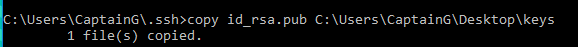

Your keys folder will now look like the following

Open up the id_rsa.pub key with a text editor and copy all the data inside of the file.

Log into your github account and enter our teams repo landing page and click on settings

Then click on deploy keys 

click add deploy key

Add a title for your key and then paste the copied conents of the id_rsa.pub key into the key section as i did in the screen shot below and then click add key 

YOU ARE NOW DONE CREATING THE KEYS NEEDED FOR THIS BUILD.

## Building Mongo.js File ##

This file will allow the server to connect to our cloud database.

Click on this link to get the credentails needed to access the cloud database
https://docs.google.com/document/d/1lZLOpFBouoMXDezbpFokJKM2ZdbGCwc7DVTAI7zI2m8/edit#

Now find and locate step number 4 in the google docs document.

copy all that text that is located in the text box

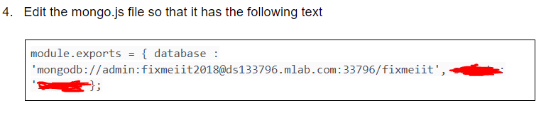

Now open up a text editor and paste the code inside the text editor

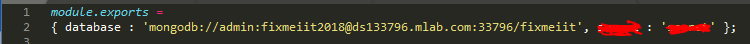

Save the file to your desktop and name it mongo.js
also make sure you save the file as a .js extension

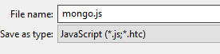

## Step 1 ##

CLONE GITHUB REPO to make sure we have the latest release of our build
 
## Step 2 ##

Open up a windows PowerShell terminal

## Step 3 ##

Install vagrant VirtualBox plugin

Command : vagrant plugin install vagrant-vbguest

## Step 4 ##

Open our team GitHub file directory on your local machine (Make sure you clone the repo beforehand)

## Step 5 ##

Click on "PackerVagrant" then "vagrant-current-builds". Now you should see the directory with our current server builds.

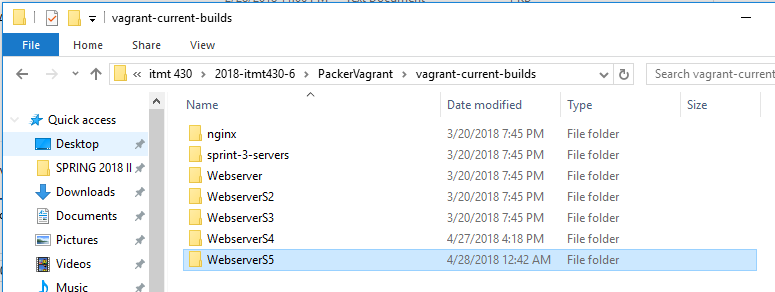

## Step 6 ## 

Drag and drop the WebserverS5 folder onto your desktop

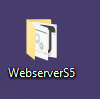

Here is the Contents that are within the WebserverS5 folder

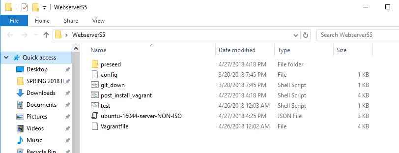

## Step 7 ##

Now locate your folder where you have YOUR "id_rsa" key and also ubuntu ISO (if building the ISO version)

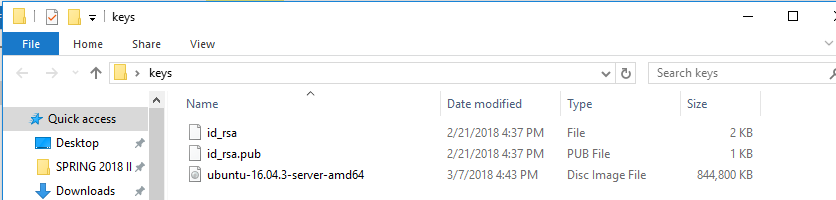

## Step 8 ## 

Copy and paste your id_rsa key into the WebserverS5 folder

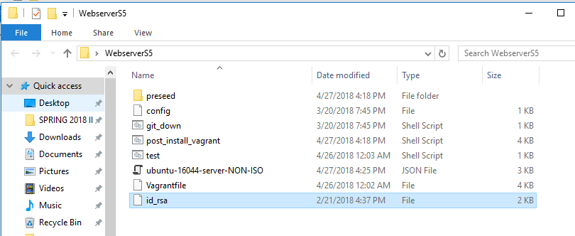

Now drag and drop the mongo.js file on your desktop into the
WebserverS5 folder as well.

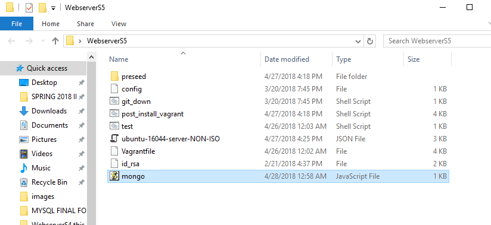

## Step 9 ##

Open up windows PowerShell and navigate to the WebserverS5 directory

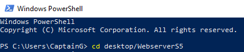

Now list the directory with the "ls" command

command: ls

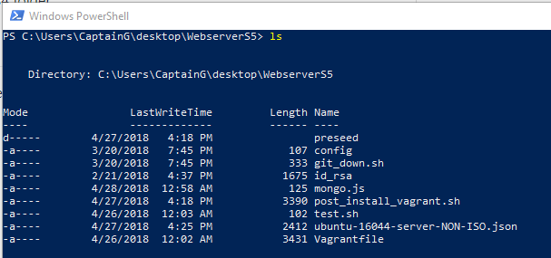

## Step 10 ##

We will now be using PACKER

on the windows PowerShell enter the command: packer build ubuntu-16044-server-NON-ISO.json

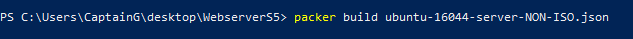

You should now see that packer will open up your virtual machine and start the configuration 
(PACKER GHOST)

Leave everything alone and be patient, packer will close the virtual box by its self and finish exporting the box file.

## Step 11 ##

Packer will create a folder named "build" and within that file will be the box file

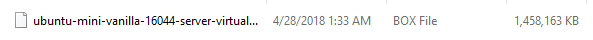

Now go back to your windows power shell and make sure you are still in the WebserverS5 directory. 
Then copy the text exactly how I do it, highlight it and then press Ctrl + c

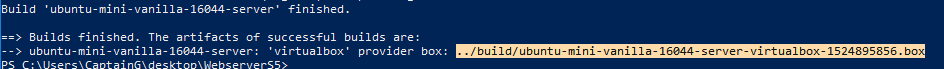

Then on the command line type: vagrant box add  --name webserverS5

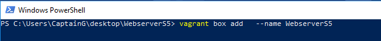

you will now copy and paste your box file address in between add & --name

now press enter

## Step 12 ## 

On windows power shell make sure you are still in the WebserverS5 directory.

Now on the windows PowerShell command line type: vagrant up

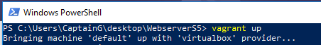

## Step 13 ## 

Our vagrant box is now up, we now need to ssh into our VirtualBox

command: vagrant ssh

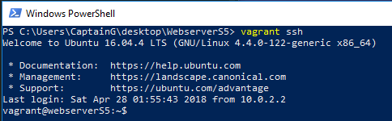

## Step 14 ##

Since this build is meant to be deployed in any environment i have setup the vagrant file to automaticaly bridge to the network and get an address assigned via DHCP.

Look at the ipv4 address for interface enp0s8, that is the ip address we will be using to access our webserver

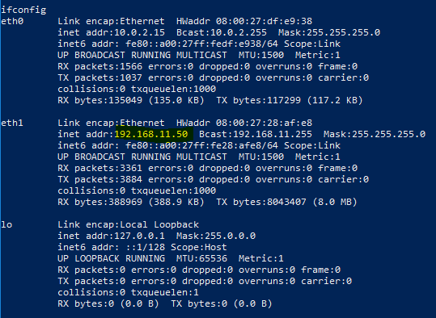

## Step 15 ##

Accessing our webserverS5

 html pages through port 80

Open any brower and type in the ip address of your webserver into the browser's url and press enter

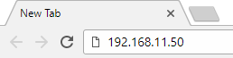

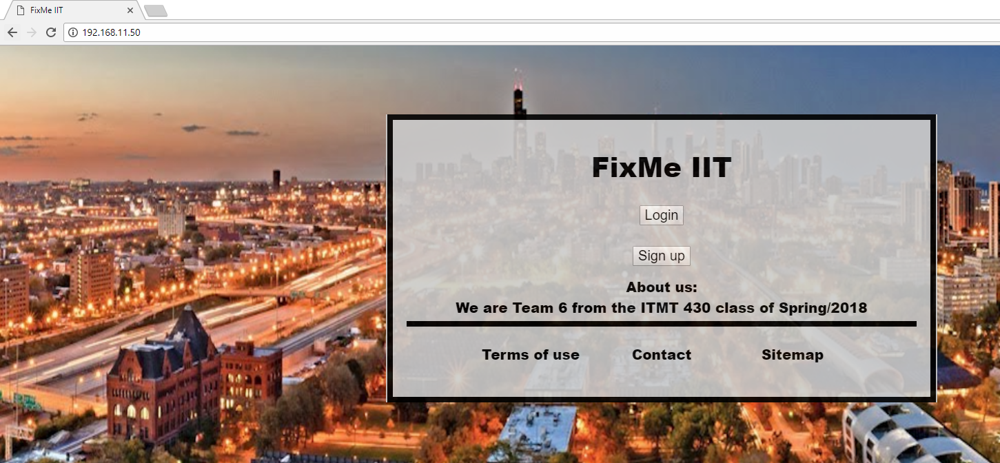

## Step 16 ##

Accessing our webserverS5 angular app through port 3000

Open any brower and type in the ip address of your webserver and at the end of that add a colon and port 3000 into the browser's url and press enter

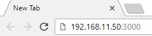

## Power Down Vagrant Box ##

When you are ready to power down the server you will have two options

vagrant halt: Will shutdown the system without destroying it, this will take resources from your hard drive but not much.

vagrant destroy: Will destroy the machine and remove resources from your system. When you run vagrant up you will have a newly built machine to start working on again. (I use this option)

## MUST DO WHEN REBUILDING TO AVOID ERRORS ##

When new configs are made to our server and we need to do this rebuilding process again there are a few things we need to think about. If we need to build a new config of our server and it still has the same vagrant box name we must remove it from the vagrant box list, because otherwise when we do vagrant box add command it will give you an error ( you can use the --force flag to overcome this). If we are using a new name for the server then we are fine and dont have to follow this guideline.

### Guide Written by Matteo Giaimo ###